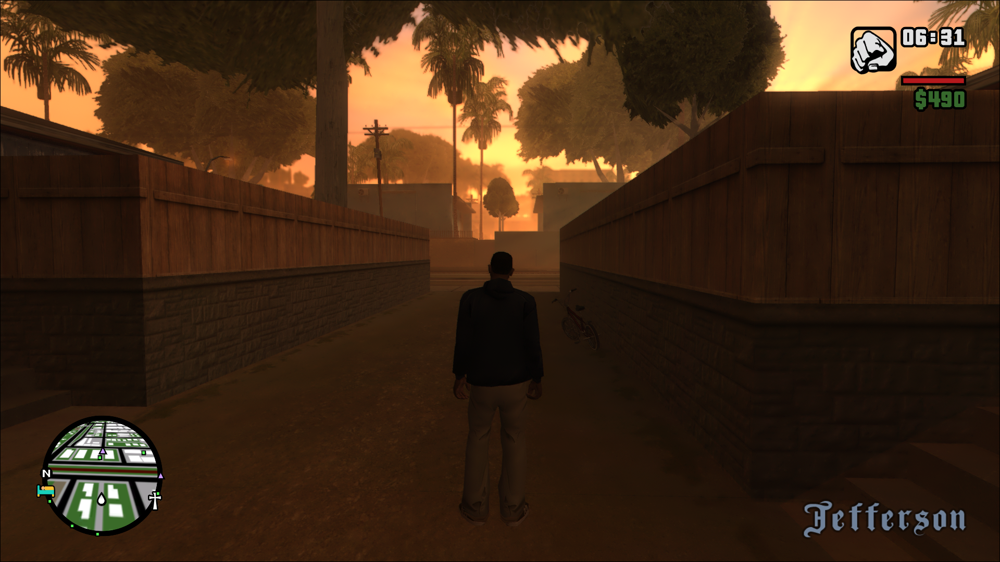
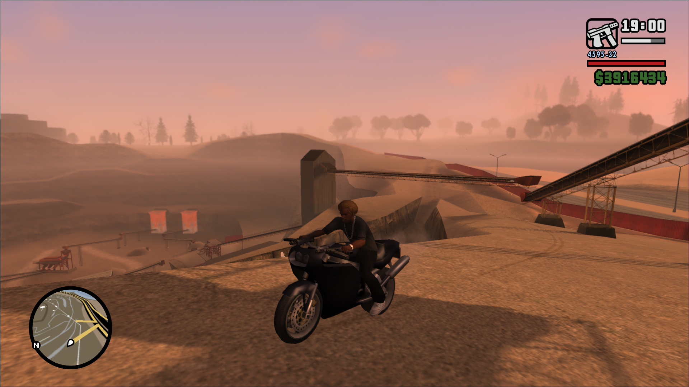
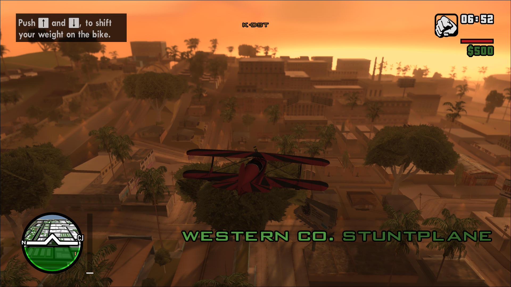

<p align="center">
  
</p>

# Tilted Radar — GTA San Andreas Mod

An experimental modification for Grand Theft Auto: San Andreas that introduces a tilted 3D perspective to the HUD radar.

---

## 📸 Screenshots

| Screenshot 1 | Screenshot 2 |
| :---: | :---: |
|  |  |

---

## ⚠️ Important Note: Beta State & Community Work-in-Progress

> **Please read carefully before installing!**

**Tilted Radar is currently in an early BETA state.** 

Because of this, you **should not expect a 100% bug-free experience**. You may encounter visual glitches, alignment issues, or minor performance kinks.

The beauty of open-source modding lies in working together:
- **Test it out:** Play with the mod and see how it performs in different scenarios.
- **Report bugs:** If you find a bug, clipping issue, or crash, please open a detailed issue in the [Issues](../../issues) tab.
- **Contribute:** If you know how to fix an issue, pull requests are warmly welcomed!

By gathering feedback and fixing problems together, we can turn this concept into a polished, finalized product for the entire GTA San Andreas community.

---

## 🐛 Known Issues & Bugs

| Bug Showcase 1 (`ss3.png`) | Bug Showcase 2 (`ss4.png`) |
| :---: | :---: |
|  |  |
| **Ghost GPS & Waypoint Marker:** A ghost GPS line may occasionally appear on screen. Additionally, the GPS target waypoint marker does not render or function correctly. | **Aircraft Radar Icon Scaling:** When flying in a plane, the altitude/planering icon on the radar is incorrectly sized and misaligned. |

---

## 🛠️ Installation & Requirements

### Requirements:
* **GTA San Andreas v1.0 US** *(Strictly required)*
* **[Modloader](https://www.mixmods.com.br/2015/01/modloader/)** (requires Ultimate ASI Loader / Silent's ASI Loader / CLEO4 and above)

### Installation Steps:
1. Download the latest `.zip` package from the [Releases](../../releases) tab.
2. Extract the `Tilted Radar` folder into your `modloader/` directory (or GTA SA root folder).
3. Launch the game!

---

## 🔗 Links & Community

* **Tilted Radar on Liberty City:** [Download page & discussion](https://libertycity.net/files/gta-san-andreas/244007-beta-tilted-radar.html)
* **My Liberty City profile:** [rixgeo](https://libertycity.net/user/rixgeo/)
* **Discord:** [Join the server](https://discord.gg/Bsbx5FU4xp)

---

## 📄 License

This project is open-source software licensed under the [GNU General Public License v3.0 (GPLv3)](LICENSE).

You are free to copy, distribute, adapt, and modify this software, provided that:

* All derivative works remain open-source under the GPLv3 license.
* Proper attribution to the original author (rixgeo) and credited contributors (dk22pac, multimaks2) is preserved.

---

## ⚙️ Building & Technical Details

This modification is built using **[plugin-sdk](https://github.com/DK22Pac/plugin-sdk)** and draws technical inspiration/foundations from **[The Definitive UI](https://github.com/multimaks2/The-Definitive-UI)** by multimaks2, which helped make this radar script implementation possible.

To compile the ASI plugin yourself:
1. Clone the repository:
   ```bash
   git clone [https://github.com/rixgeo/tilted-radar.git](https://github.com/rixgeo/tilted-radar.git)
